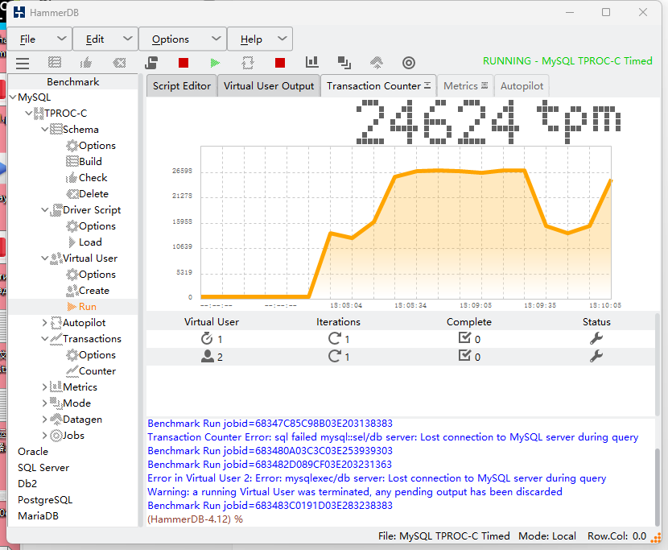
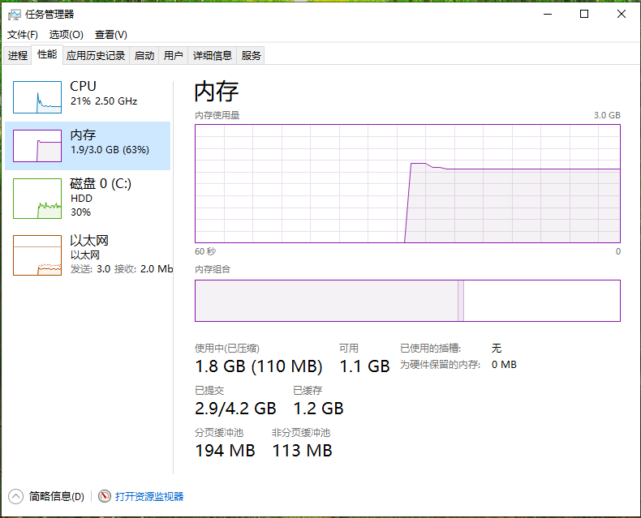

# MySQL Virtual Machine Performance Comparison (HammerDB 4.12)

## Configuration

CPU: 2 or 4 cores | RAM: 3GB | Disk: 50GB | MySQL 8.0.42 | HammerDB 4.12

## Windows 10 - 4 Cores - Test 1

## Windows 10 - 4 Cores - Test 2

## Windows 10 - 2 Cores - Test 1

## Windows 10 - 2 Cores - Test 2

## Ubuntu 24.04 - 4 Cores - Test 1

## Ubuntu 24.04 - 4 Cores - Test 2

## Ubuntu 24.04 - 2 Cores - Test 1

## Ubuntu 24.04 - 2 Cores - Test 2

## Performance Comparison Chart

